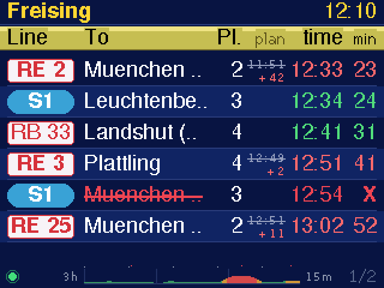
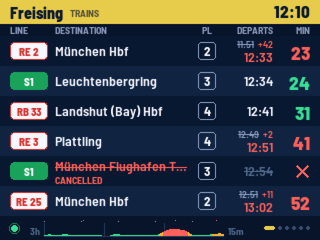
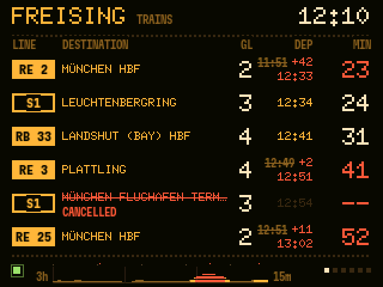
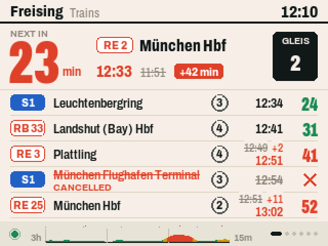
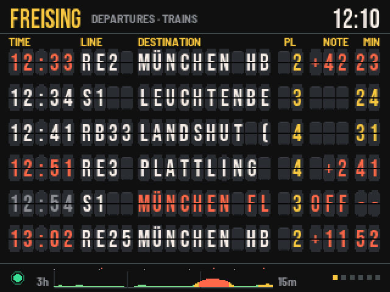
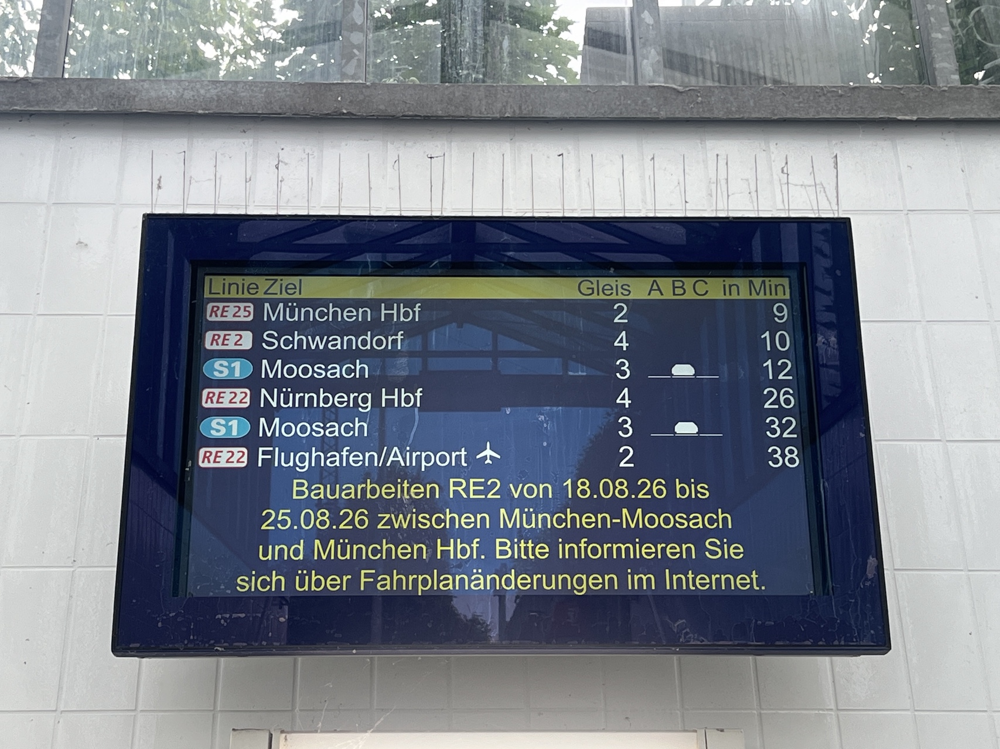
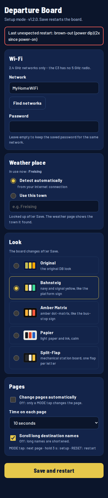

# Train Bus Weather Signboard

> **All rights reserved — permission required.** No reuse, copying, redistribution or AI/ML
> reuse is licensed without prior written permission from **Sam / @haldarsaurav**. This includes
> using protected project material as inspiration or a reference to recreate its implementation,
> documented logic, original visuals or expressive feature arrangement. Read the [full licence](LICENSE),
> [AI policy](AI_POLICY.md) and [permission guide](docs/PERMISSIONS.md) for scope and legal limits.

**A desk-sized departure board for Freising: trains, local buses and weather on a 3.2-inch screen.**

An ESP32-C3 Super Mini brings the feel of a station sign to the desk. It connects to 2.4 GHz
Wi-Fi and displays public transport and weather feeds without a phone app or an API key.

**Current revision: Rev1.2 · firmware 1.2.0**

Rev1.1 remains available at the `rev1.1-final` documentation tag.

This repository is the public feature showcase. Firmware, tests, build instructions and technical
release notes live exclusively in the [code repository](https://github.com/haldarsaurav/train_bus_weather_signboard_code).
Access to that repository depends on its permissions.

The screen images use sample data and are software previews, not hardware photographs. They
precede the final small-font contrast pass. The two enlarged legend diagrams explain Rev1.1
features with illustrative data.

## Five looks in Rev1.2

Select a look in the setup page; **Original** remains the default. The other looks are
**Bahnsteig** (navy and signal yellow), **Amber Matrix** (station display dots),
**Papier** (light paper and ink) and **Split-Flap** (mechanical flap tiles).

### Original

### Bahnsteig

### Amber Matrix

### Papier

### Split-Flap

The looks cover the train, bus, weather, outlook, boot and setup screens. Font rendering and
secondary-text contrast received a final readability pass after these sample previews.

## 3D printed enclosure: Rev7

The [Rev7 enclosure](enclosure/rev7/README_REV7.md) includes an editable FreeCAD model,
STEP export, STLs for the front shell, back plate, BOOT key and optional fit test, plus a 3MF
print layout. The case uses three M2.5 heat-set inserts and three countersunk screws.

The [rear and insert-post view](enclosure/rev7/images/rev7_rear.png) and
[back-plate view](enclosure/rev7/images/rev7_back_plate.png) are renders from the saved CAD
meshes. Physical fit, screw engagement and thermal behaviour still need a real print check.

### Tilted desk version — coming soon

A 15° tilted desk enclosure is being developed. Its CAD views and printable files will be
added here when the design is ready. See the [enclosure section](enclosure/README.md) for the
current Rev7 files and this planned variant.

### Inspiration and real-life photos

This station departure display is a **reference photo**, not a photo of this project or its
3D-printed case.

> **Coming soon — 3D-printed enclosure:** photos of the finished physical print.

> **Coming soon — signboard in use:** photos of the working device on the desk.

## Full feature and icon guide

Read the **[complete screen-by-screen guide](docs/FEATURE_GUIDE.md)** for every visible badge,
symbol, colour, field, graph, status message and setting, with its purpose and worked examples.

| Find an explanation | Guide |
| --- | --- |
| Train badges, planned/revised times, cancellations and countdowns | [Train pages](docs/FEATURE_GUIDE.md#train-pages) |
| Bus bay numbers and the N/S/E/W fallback | [Bus pages](docs/FEATURE_GUIDE.md#bus-pages) |
| Sun, crescent, cloud, fog, rain, snow, lightning and sun-event marks | [Weather symbols](docs/FEATURE_GUIDE.md#weather-symbols) |
| Temperature, feels-like, humidity, wind and day/night colours | [Weather now](docs/FEATURE_GUIDE.md#weather-now) |
| Rain bars, orange temperature line and the current-hour marker | [Twelve-hour chart](docs/FEATURE_GUIDE.md#next-twelve-hours) |
| UV, daylight changes, rain timing and lunar phase | [Three-day outlook](docs/FEATURE_GUIDE.md#next-three-days) |
| Missing data, cancellation markers, coverage and the 15-minute scale | [Delay graph](docs/FEATURE_GUIDE.md#train-delay-history) |
| Weekly marks, colour gradient and today's white cap | [Temperature history](docs/FEATURE_GUIDE.md#temperature-history) |
| Every health-dot state, startup message, QR step and setup control | [Health](docs/FEATURE_GUIDE.md#data-health-and-messages) · [Setup](docs/FEATURE_GUIDE.md#boot-controls-and-setup) |

## What it shows

| Feature | On the desk |
| --- | --- |
| Train departures | Freising station, up to 24 trains across four pages, six per page |
| Useful departure details | Line, destination, platform, departure time and minutes remaining |
| Reported delays | Planned time struck through beside the revised time; delay highlighted |
| Cancellations | Red struck-through destination and an X in the countdown column |
| Two bus boards | Bahnhof Stadtbus and P+R-Platz, up to ten services each |
| City-bus filtering | The Bahnhof board keeps town routes separate from regional/express coaches |
| Current weather | Temperature, feels-like, conditions, rain, humidity, wind and sunrise/sunset |
| Next twelve hours | Rain probabilities and a temperature trend |
| Three-day outlook | High/low, feels-like, UV, rain timing, sun times, daylight change, wind and moon phase |
| Temperature history | Last 30 daily highs plus today, coloured by temperature |
| Delay history | Three hours of reported train-board snapshots, with missing-data gaps |
| Day and night colours | Weather backgrounds follow daytime, twilight and night |

A timetable time without a delay is not proof that a train is on time. Realtime information
and cancellations depend on the operator data available through the feed.

## Train and bus pages

Long destinations can scroll when enabled. Platform/bay information appears when supplied.
The Bahnhof Stadtbus and P+R boards each have their own page and refresh status.

| Bahnhof Stadtbus | P+R-Platz |
| --- | --- |
|  |  |

## The improved delay graph

Rev1.1 shows the average positive reported delay of eligible realtime trains due within the
next hour. It uses the fetched board, across all train pages, and does not claim to measure
final per-train punctuality. The same upcoming train can contribute to successive snapshots.

- **Time:** 180 elapsed-minute columns, oldest left and newest right, with hourly guides.
- **Colour:** green below 1.5 minutes, amber below 4 minutes, red from 4 minutes.
- **Height:** 0–15 minutes; a white cap marks values above that display scale.
- **Red top markers:** cancellations, kept separate from the delay average.
- **Grey markers:** incomplete realtime coverage among services in the window.
- **Gaps:** no usable observation, an empty eligible set or a failed/missed refresh.

For example, one cancelled train and one reported on-time train show a cancellation marker
and a zero-delay reading. The cancellation is not converted into an invented number of minutes.
History starts blank after a reboot and fills while the device runs.

## Weather pages

| Now | Next three days |
| --- | --- |
|  |  |

Choose a weather town in setup, or use approximate location detected from the internet
connection. The location affects weather; the configured transport stops remain in Freising.
Forecast dates and daylight calculations use Europe/Berlin time.

## Controls and setup

| Control | Action |
| --- | --- |
| Tap MODE | Next page |
| Hold MODE for one second | Show the hold-progress hint |
| Keep holding to three seconds | Open setup |
| Save in setup | Store settings and restart |
| RESET | Restart the device |

MODE is the board's BOOT button. Hold it after startup begins, not while powering on or pressing
RESET, because that can select the chip's download mode.

On first use, join **Desk-Transport-Display** using the on-screen Wi-Fi QR. Once connected,
scan the settings QR or open **http://192.168.4.1/**. Setup can also be opened with MODE later.
It remains open until Save or RESET.

| Setting | Default / behaviour |
| --- | --- |
| Wi-Fi network | Type the name or choose a scanned network; hidden networks are supported |
| Wi-Fi password | Blank preserves the saved password when keeping the same network |
| Weather place | Automatic detection or a typed town |
| Automatic page changes | Off |
| Page interval | 10 seconds; selectable from 5 to 60 seconds |
| Scrolling long destinations | Off |
| Look | Original; four more looks available |

### Look selector in the setup portal

The current setup page has a **Look** card with all five choices. The preview below shows
the selector in context; [open the full-size setup preview](docs/previews_v1.2.0/portal_0.png)
to inspect the controls.

## Electricity use

Using the reported **about 0.75 W**, running continuously uses **6.57 kWh/year**
(`0.00075 kW × 24 hours × 365 days`). At Freisinger Stadtwerke's published 2026
**MaxiStrom** energy rate of **30.95 ct/kWh**, that is **about €2.03/year** (about
**€0.17/month**). At the **Grundversorgung**
single-rate energy price of **33.07 ct/kWh**, it is **about €2.17/year**. See the
[MaxiStrom tariff](https://www.freisinger-stadtwerke.de/de/Energie-Wasser/Strom/Unsere-Tarife/)
and [Grundversorgung price sheet](https://www.freisinger-stadtwerke.de/de/Energie-Wasser/Strom/Unsere-Tarife/Unsere-Tarife-100-Oekostrom/20251114-Preisblatt-Strom-GV-ab-Januar-2026.pdf).
These are the extra energy costs on an existing household supply; standing charges are not
allocated to the signboard. The estimate changes if its average power or your tariff differs.

## Reliability in Rev1.1

Each transport feed and the weather feed has its own health state. A successful weather
refresh cannot hide a failed train refresh. Empty results, initial loading and failures are
distinguished. Countdown times continue advancing during outages and expired rows are removed.

Requests have bounded waits, MODE remains available during Wi-Fi joining, and setup saving
recovers cleanly from reported errors. Prolonged connectivity/data failures trigger recovery.
The device needs internet access for fresh information; retained readings can become stale.

Rev1.1 passed firmware compile/link checks, 52 logic/graph assertions and five setup-page
JavaScript tests. Physical flashing, the new graph's appearance and long-running hardware
stability still need verification.

## Hardware

- ESP32-C3 Super Mini
- 3.2-inch ILI9341 SPI TFT, 240 × 320 native, used as 320 × 240 landscape
- USB power and the existing BOOT/MODE button

See the [wiring reference](docs/SCHEMATIC.md). Board-specific backlight connections must match
the actual display module. Build and flashing instructions are maintained in the code repository.

## Revision history

**Rev1.2 — 26 September 2026:** five selectable looks and themed setup page; small-font
contrast and text fitting audit; Rev7 enclosure CAD and print section. The showcase now also
shows the current Look selector, consistent theme previews, an inspiration photo, planned
tilted-case and real-photo slots, and a measured-power running-cost estimate. Firmware build and
regression status are maintained in the [code repository](https://github.com/haldarsaurav/train_bus_weather_signboard_code).

**Rev1.1 final documentation — 25 September 2026:** expanded permission-only licence and AI-use
policy in both repositories; complete icon/feature guide, examples and two verified legend diagrams.
Firmware remains 1.1.0. [Project status](docs/PROJECT_STATUS.md) records the scope of completion.

**Rev1.1 — 24 September 2026:** corrected delay measurement and elapsed-time history; separate
cancellation and coverage markers; clearer missing-data behaviour. Includes the Rev1 review's
feed-health, countdown, setup, timestamp, network recovery and weather-date improvements.

**Rev1 — 24 September 2026:** local reviewed project package, firmware 1.0.1.

**Initial release:** train, bus and weather pages, setup portal, graphs and display animations.

## Data and project rights

Transport data is provided through [Transitous](https://transitous.org/), with timetable and
realtime contributions from its upstream sources. Forecast and historical weather come from
[Open-Meteo](https://open-meteo.com/). These services determine availability and coverage.

This is an independent personal project, not an official Deutsche Bahn or transit-operator product.
Copyright 2026 Sam (haldarsaurav). All rights reserved; see [LICENSE](LICENSE).
