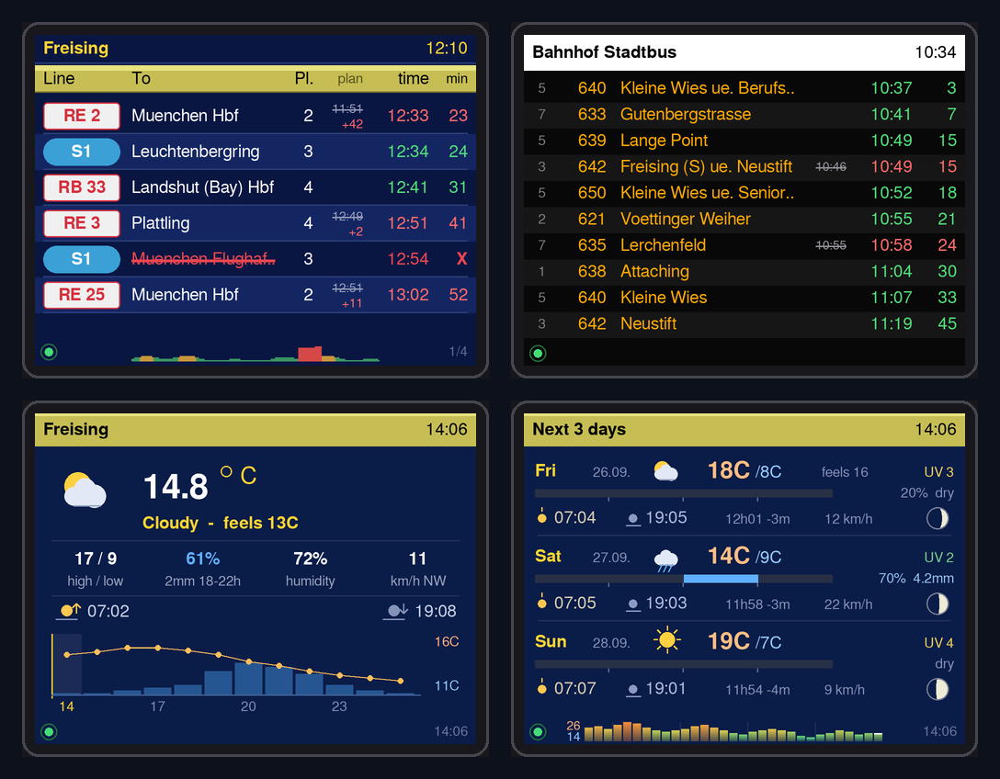
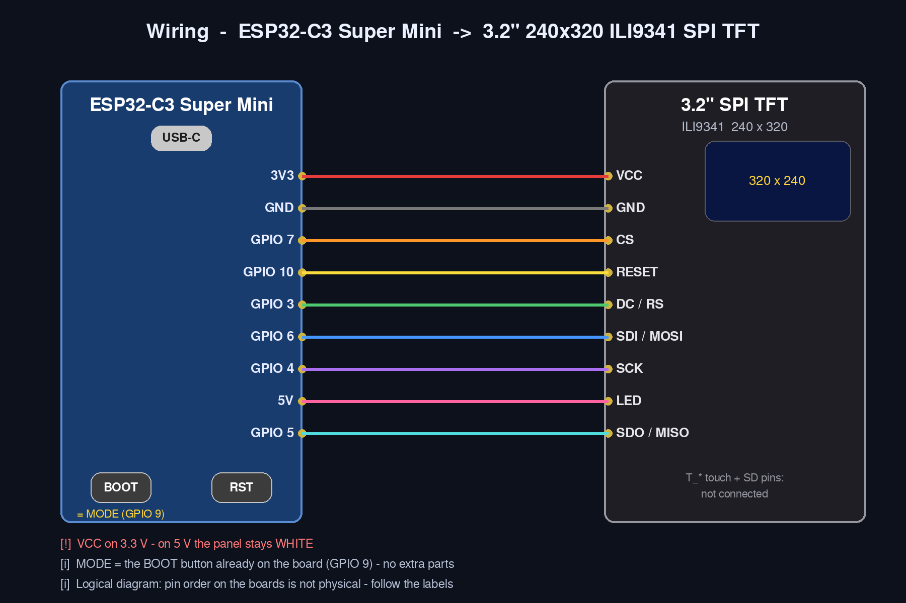
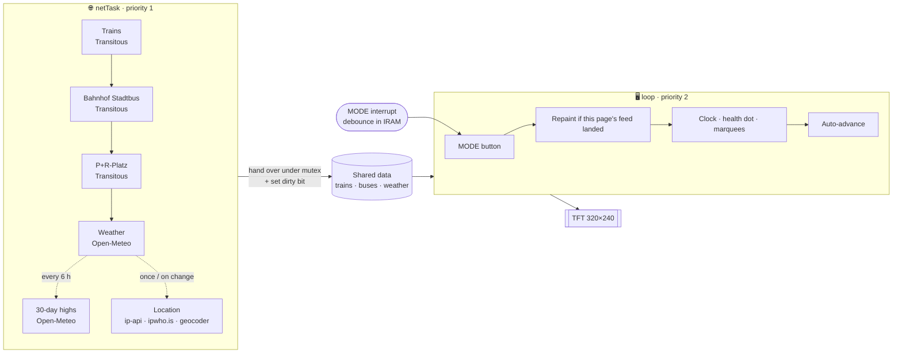

# 🚆🚌🌦️ Train Bus Weather Signboard

**A desk-sized departure board for Freising — live trains, city buses and weather on a 3.2″ TFT, driven by an ESP32-C3 Super Mini.**
No cloud account, no app, no API keys. It joins your Wi-Fi and draws.




> 🖼️ All screen images in this README are **generated renders** made from the same layout
> numbers as `Draw.ino`, with example data. The real panel has some backlight bleed, so black
> is never quite black.

---

## 📑 Contents

- [✨ Features](#-features)
- [🖥️ The screens](#️-the-screens)
- [🎛️ Controls](#️-controls)
- [⚙️ Setup mode and every option](#️-setup-mode-and-every-option)
- [🔌 Hardware and wiring](#-hardware-and-wiring)
- [🛠️ Building and flashing](#️-building-and-flashing)
- [🚀 First run](#-first-run)
- [🧠 How it works](#-how-it-works)
- [🌐 Data sources](#-data-sources)
- [🧩 Adapting it](#-adapting-it)
- [🩺 Troubleshooting](#-troubleshooting)
- [📏 Measured on the hardware](#-measured-on-the-hardware)
- [📁 Repository layout](#-repository-layout)
- [📜 Changelog](#-changelog)
- [©️ Licence](#️-licence)

---

## ✨ Features

| | Feature | What it means on the desk |
|---|---|---|
| 🚆 | **Live train departures** | Freising station, up to 24 trains over 4 pages — line badge, destination, platform, realtime time, minutes to go |
| ⏱️ | **Delays the way a platform sign shows them** | Planned time small and **struck through**, `+N` under it, revised time in red. No second number = on time |
| ❌ | **Cancellations** | Destination struck through in red, `X` in the minutes column |
| 🚌 | **Two bus boards** | *Bahnhof Stadtbus* (town buses only — regional/express coaches filtered out) and *P+R-Platz*, 10 rows each |
| 🅱️ | **Bay numbers** | Stadtbus rows show the real bay; the column only appears when bays actually differ |
| 🌤️ | **Weather now** | Temperature, feels-like, description, high/low, rain chance + *when* + mm, humidity, wind + compass point, sunrise/sunset |
| 📈 | **Next 12 hours** | Rain-probability bars with a temperature line on top and a "now" marker |
| 📅 | **Next 3 days** | Sky icon, high/low, feels-like, UV (colour-coded), a 24-hour **rain-timing bar**, sunrise/sunset, day length and its daily change, wind, **moon phase** |
| 🌡️ | **30-day temperature graph** | Last 30 daily highs + today in the 3-day footer — smooth blue→green→yellow→red colour per °C, bars fading into the sky, weekly marks, warmest/coldest high printed |
| 📊 | **3-hour delay graph** | Average lateness of all fetched trains, one pixel per minute, in every train page footer |
| 🌗 | **Sky tint** | Weather pages turn plum around sunrise/sunset and navy at night |
| 📍 | **Weather place** | Detected automatically from your internet connection, or a town you type in setup |
| 🟢 | **Health dot** | One colour-coded, animated dot says whether what you see is fresh |
| 🔘 | **One button** | Tap = next page, hold 3 s = setup. Works on the splash, while running, and while Wi-Fi is joining |
| 📱 | **Phone setup** | Scan the QR → join the setup Wi-Fi → scan again → settings page. Wi-Fi scan picker included |
| 🧯 | **Self-healing** | Wi-Fi re-join, data-stale recovery, watchdog, heap guards, TLS timeouts |
| 🧾 | **Restart log** | Any *unexpected* restart (crash, watchdog, brown-out…) is remembered and shown in red on the next boot and in setup |
| 🪶 | **Light on the chip** | 4 HTTPS calls a minute, drawing on its own task, no full-screen buffer, no web server in normal running |

---

## 🖥️ The screens

Up to **eight screens**, in this order. A **MODE tap** moves exactly one page.

| # | Screen | Rows | Source | Refresh |
|---|---|---|---|---|
| 1 – 4 | 🚆 Trains, Freising station | 6 per page, as many pages as there are trains (max 4) | Transitous | 60 s |
| 5 | 🚌 Bahnhof Stadtbus | 10 | Transitous | 60 s |
| 6 | 🅿️ P+R-Platz | 10 | Transitous | 60 s |
| 7 | 🌤️ Weather now + next 12 h | — | Open-Meteo | 60 s |
| 8 | 📅 Next 3 days + 30-day graph | 3 days | Open-Meteo | 60 s (graph: 6 h) |

Each page fills in on its own as its feed lands — nothing waits for the slowest source.
Until then it says **Loading…**, and after a successful fetch with nothing in it, **No departures**.

### 🚆 Trains


| Column | Shows |
|---|---|
| **Line** | White plate with red text for RE/RB/IC…, blue lozenge for S-Bahn |
| **To** | Destination (optionally scrolls if too long) |
| **Pl.** | Platform — section suffixes like `3-S` are trimmed to `3` |
| **plan** | Only on late rows: timetable time struck through, `+N` minutes under it |
| **time** | When it will *actually* leave — 🟢 on time, 🔴 late or cancelled |
| **min** | Minutes to go (blank after 60 min, `X` if cancelled) |
| Footer | 🟢 health dot · 📊 delay graph (last 3 h) · page `1/4` |

### 🚌 Buses

| Bahnhof Stadtbus | P+R-Platz |
|---|---|
|  |  |

Amber dot-matrix look, white name band with the clock. Bay column on the left only when bays differ.
Headsigns are tidied: `[P+R]`-style notes are dropped, and the ` ue. <via>` tail goes when the name still doesn't fit.

### 🌤️ Weather

| Now + 12 hours | Next 3 days |
|---|---|
|  |  |

**Reading a 3-day row:**

```
Sat 27.09.  ☁️🌧   14C /9C              UV 2      ← sky, high / low, (feels), UV
[▁▁▁▁▁▁▁▁▁▁▁▁████████▁▁▁▁▁▁▁▁▁▁]    70% 4.2mm     ← 24-hour bar: lit = wet hour; ticks at 06/12/18
☀ 07:05   ◒ 19:03   11h58 -3m   22 km/h    🌓     ← sunrise, sunset, day length (+/- vs day before), wind, moon
```

**The 30-day graph** (3-day page footer): one bar per day, today on the right with a white cap.
Height = that day's high, scaled to the window. Colour runs smoothly through
−10 🟦 · 0 🔵 · 8 🩵 · 15 🟩 · 20 🟨 · 25 🟧 · 32 °C 🟥, each bar fading towards the sky at its foot.
Faint lines mark 1–4 weeks back; the small numbers on the left are the warmest and coldest high in the window.

The sky behind both weather pages follows the day:


| Tint | When |
|---|---|
| 🔵 Day blue | between sunrise and sunset |
| 🟣 Twilight plum | 40 min either side of sunrise / sunset |
| 🌑 Night navy | after dusk, before dawn (the icon shows a moon) |

---

## 🎛️ Controls

The button printed **BOOT** on the ESP32-C3 board is the finished device's **MODE** button.

| Input | What happens |
|---|---|
| 👆 **Tap MODE** | Next page — exactly one, and the auto-advance timer restarts |
| ✋ **Hold MODE 1 s** | Footer shows *keep holding for setup…* with a yellow progress bar. Let go now → nothing changes |
| ✋ **Hold MODE 3 s** | **Setup mode** — works while running, on the boot splash, and during the Wi-Fi join |
| 🔄 **RESET** | Hardware restart |
| 💾 **Save** (setup page) | Stores everything and restarts into normal running |


> ⚠️ **Don't hold MODE while plugging in or pressing RESET.** GPIO 9 is a strapping pin: the chip then
> starts its own flash-download mode and the screen stays dark. Press RESET again. Hold MODE only
> *after* the splash appears (it waits 1.5 s for you).

---

## ⚙️ Setup mode and every option

### How to get in

Setup opens by itself on **first boot** (no Wi-Fi saved) or when the saved Wi-Fi **can't be joined**.
Any other time: **hold MODE 3 s**.

1. 📱 Scan the QR on the screen → your phone joins **`Desk-Transport-Display`** (WPA2, password in the QR).
2. 📱 Once a phone is connected the QR **switches to the settings URL** — scan it again.
   Or browse to **http://192.168.4.1/**.
3. ✍️ Change what you want → **Save and restart**.

Setup mode **never times out** — a sleeping phone can't restart the board under you. It ends on Save or RESET.
In normal running there is **no web server at all** (see [why](#-how-it-works)).


### Options on the setup page

| Card | Option | Default | Notes |
|---|---|---|---|
| 📶 Wi-Fi | **Network** | — | Type it, or **Find networks** to pick from a scan (strongest first) |
| | **Password** | — | Empty = keep the saved password for the same network |
| 📍 Weather place | **Detect automatically** | ✅ | From your internet connection's public address (ip-api.com, fallback ipwho.is). City-level |
| | **Use this town** | — | Any town name, looked up with the Open-Meteo geocoder after Save |
| 📄 Pages | **Change pages automatically** | ❌ off | Off = only MODE changes the page |
| | **Time on each page** | 10 s | 5 / 10 / 15 / 20 / 30 / 45 / 60 s |
| | **Scroll long destination names** | ❌ off | Off = long names are shortened with `..` |

The page also shows a red **"Last unexpected restart: …"** line when there is one to report.

<br clear="right">

### Build-time options (`DeskDisplay.h`)

| Setting | Default | What it does |
|---|---|---|
| `AP_PASSWORD` 🔒 | `"change-me-please"` | Setup access point password (≥ 8 chars). Also goes into the QR. **Set it in `DeskSecrets.h`** |
| `WIFI_FALLBACK_SSID` / `_PASS` 🔒 | empty | Hard-code a network if the setup AP won't show on your phone. **In `DeskSecrets.h`** |
| `Config::TRAIN_FIXED_ID` / `TRAIN_LABEL` | Freising | Which station the train pages show |
| `Config::BUS_STOPS[]` | Stadtbus, P+R | The bus boards: label, stop id, *city-bus-only* filter, how many to request |
| `Config::WEATHER_LAT/LON/LABEL` | Freising | Fallback until the weather place has been found once |
| `Config::DATA_REFRESH_MS` | 60 000 | Refresh cycle |
| `Config::MAX_TRAIN_PAGES` / `MAX_TRAINS` | 4 / 24 | Train pages × 6 rows |
| `Config::BUS_ROWS_PER_PAGE` | 10 | Rows per bus board |
| `Config::HOLD_FOR_SETUP_MS` | 3 000 | MODE hold for setup |
| `Config::REVEAL_STEP_MS` | 14 | Row-cascade speed of the page transition |
| `Config::WATCHDOG_S` | 60 | Task watchdog |
| Colours (`DB_BLUE`, `BUS_AMBER`, `WEATHER_*` …) | sampled from real signs | Every colour is a named `constexpr` |

### 🔒 Private settings: `DeskSecrets.h`

Passwords never live in the published code. Copy `DeskTransportDisplay/DeskSecrets.example.h` to
`DeskSecrets.h` in the same folder and put your values there — the file is **git-ignored**, and
`DeskDisplay.h` picks it up automatically (`__has_include`). Without it the sketch still builds with
the placeholder password `change-me-please`.

> 🙈 The QR codes in this README are blurred on purpose — the real one carries the setup password.

### What is stored (NVS namespace `desk-display`)

| Key | Holds |
|---|---|
| `ssid`, `pass` | Wi-Fi |
| `geo-q` | typed town (empty = automatic) |
| `geo-lat`, `geo-lon`, `geo-city` | the place in use, cached after lookup |
| `rotate`, `pagesec`, `marquee` | page options |
| `swwhy`, `badwhy`, `badcount` | restart log |
| `cfgver` | settings layout version (old keys are cleaned up automatically) |

---

## 🔌 Hardware and wiring

### 🧾 Parts

| Qty | Part | Notes |
|---|---|---|
| 1 | **ESP32-C3 Super Mini** | RISC-V, Wi-Fi 2.4 GHz only, USB-C, BOOT + RST buttons |
| 1 | **3.2″ SPI TFT, 240 × 320, ILI9341** | The common red module with touch + SD pins (those stay unused) |
| 9 | Jumper wires | |
| 1 | USB-C cable + 5 V supply | |

That's it — no resistors, no extra button.

### 🗺️ Wiring



| TFT pin | ESP32-C3 | |
|---|---|---|
| VCC | **3V3** | ⚠️ **not 5 V** — on 5 V the panel stays white |
| GND | GND | |
| CS | GPIO 7 | |
| RESET | GPIO 10 | |
| DC / RS | GPIO 3 | |
| SDI / MOSI | GPIO 6 | |
| SCK | GPIO 4 | |
| SDO / MISO | GPIO 5 | |
| LED | 5V | backlight |
| T_* / SD_* | — | not connected |

📐 Text schematic (for printing / quick reference):

```
ESP32-C3 Super Mini                     3.2" TFT (ILI9341)
───────────────────                     ──────────────────
3V3      ●──────────────────────────────● VCC
GND      ●──────────────────────────────● GND
5V       ●──────────────────────────────● LED
GPIO 7   ●──────────── CS ──────────────● CS
GPIO 10  ●──────────── RESET ───────────● RESET
GPIO 3   ●──────────── DC ──────────────● DC / RS
GPIO 6   ●──────────── MOSI ────────────● SDI / MOSI
GPIO 4   ●──────────── SCK ─────────────● SCK
GPIO 5   ●──────────── MISO ────────────● SDO / MISO
GPIO 9   ●── [BOOT] ── GND   (= MODE)     T_* / SD_*  not connected
```

The full version with the power path is in **[docs/SCHEMATIC.md](docs/SCHEMATIC.md)**.

**Panel config** (LovyanGFX, in `DeskDisplay.h`): `Panel_ILI9341`, 240 × 320, `invert = false`,
`rgb_order = false`, `setRotation(1)` → 320 × 240 landscape. Serial prints `panel 320 x 240` at boot.

---

## 🛠️ Building and flashing

### 📚 Libraries (Library Manager)

| Library | Version | Why |
|---|---|---|
| **LovyanGFX** | current | Display driver, fonts, sprite, QR code |
| **ArduinoJson** | **v7** | Uses the elastic `JsonDocument` — v6 will not compile |

Board package: **esp32 by Espressif**. Built and flashed on **3.1.3** (ESP-IDF 5); **2.0.17** (ESP-IDF 4) also works —
the one API difference (`esp_task_wdt_init`) is handled behind `ESP_IDF_VERSION_MAJOR`.

### 🔧 Tools menu

| Setting | Value |
|---|---|
| Board | **ESP32C3 Dev Module** |
| Port | your board's COM port |
| USB CDC On Boot | **Enabled** (serial log over USB) |
| Partition Scheme | **Huge APP (3MB No OTA/1MB SPIFFS)** |
| Erase All Flash Before Sketch Upload | **Disabled** ⚠️ |

> 💥 **Keep "Erase All Flash" off.** It wipes NVS — your Wi-Fi and settings — on every upload,
> and you're back at the setup access point each time.

> 📝 **Arduino IDE gotcha:** the IDE writes its open editor tabs over the files on disk when you
> Verify/Upload. If you edit the files with another tool, close the IDE first, then reopen.

Open `DeskTransportDisplay/DeskTransportDisplay.ino`; the other files open as tabs.

| Tab | Role |
|---|---|
| `DeskDisplay.h` | User options, panel config, constants, **every** shared declaration |
| `DeskSecrets.example.h` | Template for your private `DeskSecrets.h` (passwords; git-ignored) |
| `DeskTransportDisplay.ino` | Globals, boot splash, `setup()`, `loop()`, MODE button, restart log |
| `Util.ino` | Text, time, sorting, formatting, page counts, button interrupt |
| `Net.ino` | Wi-Fi join, HTTPS + JSON, Transitous, Open-Meteo, location, network task |
| `Draw.ino` | Every pixel: screens, health dot, clock, graphs, page transition |
| `Portal.ino` | Settings in NVS, setup access point, setup page, setup screen |

The IDE concatenates tabs in its own order, so every tab includes `DeskDisplay.h` and nothing
relies on Arduino's prototype generator.

---

## 🚀 First run

0. 🔒 Copy `DeskSecrets.example.h` → `DeskSecrets.h` and set your own `AP_PASSWORD`.
1. ⚡ Flash. With no Wi-Fi saved, the board opens **setup mode** and shows a QR.
2. 📱 Scan → join `Desk-Transport-Display` → scan the new QR (or open http://192.168.4.1/).
3. 📶 **Find networks** → pick yours → password → choose the weather place → **Save and restart**.
4. 🚆 The board restarts, joins, syncs the clock (NTP, Europe/Berlin with DST) and goes straight to page 1.

> 📡 **2.4 GHz only.** The C3 has no 5 GHz radio. If your router publishes a separate 5 GHz
> name, that one is invisible to the board — the log (and the setup screen) will say
> *"… not on 2.4 GHz"*.

---

## 🧠 How it works

### Two tasks, one lock



- **`loop()`** owns the panel and the button, at FreeRTOS priority **2**. It never waits on a socket.
- **`netTask`** does all fetching at priority **1**, so on this single-core chip a TLS handshake only
  gets the CPU the loop leaves idle — drawing and the button always win.
- Each feed is fetched into a scratch buffer with the lock **open**; the lock is taken only for the
  microseconds of the handover. Each feed sets its own **dirty bit**, and the loop repaints only if the
  page on screen shows that feed — weather landing never flashes the train board.

### 🔁 One refresh cycle (every 60 s)

| Step | Call | Parsed |
|---|---|---|
| 1 | `api.transitous.org/api/v5/stoptimes` — Freising, rail modes, `n=30` | up to 24 trains |
| 2 | same, Stadtbus bays, bus modes, `n=24`, route id must contain `StadtBus` | 10 buses |
| 3 | same, P+R-Platz, `n=14` | 10 buses |
| 4 | `api.open-meteo.com/v1/forecast` — current + 4 days daily + hourly, unix time | weather |
| (5) | location lookup — only until found, or after a change in setup | lat/lon/town |
| (6) | 30 days of daily highs — every 6 h | graph |

**Four HTTPS calls a minute.** Every stop is a pinned id; zero departures is a valid answer, never a trigger for extra lookups.
The serial log (115200) prints the duration of every fetch and the whole cycle.

### 🟢 The health dot

| Colour | Means |
|---|---|
| 🟢 green, breathing ring | last cycle brought everything back |
| 🟠 amber | one feed missed; the next cycle should fix it |
| 🔴 **red, blinking** | nothing fresh for 3½ min, or no Wi-Fi — **the times on screen are old** |
| ⚪ grey | waiting for the first data after boot |

A fetch in flight **dims** whichever colour is showing instead of having its own colour, so "busy" can never hide "stale".
It's also the heartbeat: as long as it breathes, the loop is alive.

### 🎞️ Page transition without a frame buffer

A full 320 × 240 × 16-bit frame is 150 KB — too much next to TLS on a C3 without PSRAM. Instead:

1. `wipeScreen()` takes the old page off in 15-px bands behind a lit edge (~90 ms).
2. The new page draws in its normal single pass, but each row calls `revealPause()`, so rows land
   one after another (~14 ms apart).

≈ 200 ms, zero allocation, every pixel drawn once.

### 🧊 Flicker-free live updates

The clock, the health dot and scrolling names redraw while a page is up. They render into one
shared **256 × 24 sprite** (12 KB, allocated once at boot) and are pushed in a single transfer with
unused pixels keyed out — no visible background flash. If the sprite ever can't be allocated,
everything falls back to drawing straight onto the panel.

### 🧯 Staying alive

| Guard | Detail |
|---|---|
| ⏲️ Watchdog | 60 s task watchdog on both tasks |
| 🔐 TLS handshake timeout | 8 s (library default was 120 s — twice the watchdog) |
| 🧠 Heap guard | a fetch is **skipped** if free heap < 50 KB or the largest block < 40 KB |
| 📶 Wi-Fi lost | net task re-joins every 30 s; after **15 min** without Wi-Fi → clean restart |
| 📭 No data | after **30 min** → re-join Wi-Fi once; after another 30 min → restart |
| 🐢 Slow streams | `PatientStream` waits for the next byte instead of treating an empty TLS buffer as end-of-file |
| 🧾 Restart log | reset reason mapped to words; unexpected ones counted in NVS and shown on splash + setup |

| Restart reason shown | Likely cause |
|---|---|
| `brown-out (power dip)` | weak USB supply/cable — Wi-Fi burst + backlight |
| `watchdog - something blocked` | a task stalled > 60 s |
| `crash (panic)` / `interrupt watchdog` | firmware fault |
| `no Wi-Fi for 15 min` / `no data for an hour` | deliberate recovery restart |

### 🔘 Why the button is always responsive

- A CHANGE interrupt debounces both edges (40 ms) using the raw GPIO register and `esp_timer` — both IRAM-safe.
- A **tap** is a press shorter than 1 s; one press is one tap, however much the contacts bounce.
- A glitch-guard clears a stuck "down" state if the pin has really been high for 80 ms.
- While MODE is held, the loop draws nothing else, so the hint and progress bar stay put.

### 🚫 Why there's no web page in normal running

`WebServer::handleClient()` on core 3.x can wait up to 5 s for a browser that opened a connection
and hasn't sent yet. Served from the drawing loop, that froze the clock, the dot and MODE. So the
web server only exists in setup mode, where nothing else runs.

---

## 🌐 Data sources

| Source | Used for | Key? |
|---|---|---|
| 🚉 [Transitous](https://transitous.org/) (MOTIS) | trains + buses, realtime | none |
| 🌦️ [Open-Meteo](https://open-meteo.com/) forecast | current, hourly, 4-day daily, 30-day history | none |
| 🗺️ Open-Meteo geocoding | "Use this town" | none |
| 📍 ip-api.com → ipwho.is | "Detect automatically" | none |
| 🕒 pool.ntp.org, time.cloudflare.com | clock | none |

Stop ids, verified against the live feed:

| Board | Transitous id |
|---|---|
| Freising station — trains **and** Stadtbus bays | `de-DELFI_de:09178:2680` |
| P+R-Platz | `de-DELFI_de:09178:2831:1:1` |

Notes worth keeping:

- The station id serves rail **and** the Stadtbusbahnhof; only `mode=` differs. Town buses are told apart by
  the route id containing `StadtBus` (vs `RegionalBus` / `ExpressBus`).
- A parent id **without** a quay suffix works for the station but **not** for a street stop (`stop_found=false`).
- `/stoptimes` returns departures with both `departure` (realtime) and `scheduledDeparture` — that pair is
  what drives the struck-through plan column.
- Sunrise/sunset/day length come from the forecast; the **moon phase** is computed from the date
  (synodic month 29.530588 d, reference new moon 2000-01-06 18:14 UTC).

---

## 🧩 Adapting it

*(Needs the author's permission — see [Licence](#️-licence).)*

| Want | Change |
|---|---|
| 🏙️ Another station | `TRAIN_FIXED_ID`, `TRAIN_LABEL` — find ids at `https://api.transitous.org/api/v1/geocode?text=<name>&type=STOP` |
| 🚏 Other bus stops | `BUS_STOPS[]` + `BUS_STOP_COUNT` (keep `DIRTY_BUS0 << i` within 5 stops) |
| 📄 More/fewer train pages | `MAX_TRAIN_PAGES`, `MAX_TRAINS` (= pages × 6) |
| 📏 Rows per bus board | `BUS_ROWS_PER_PAGE` with `BUS_ROW_TOP` / `BUS_ROW_H` |
| 🎨 Colours | the named `constexpr` palette in `DeskDisplay.h` |
| 🔤 Fonts | `setFontOn()` in `Util.ino` — 21–26 are FreeSans faces, 20 is DejaVu 9, 2 the small bitmap |

---

## 🩺 Troubleshooting

| Symptom | Cause → fix |
|---|---|
| ⬜ White screen, backlight on | TFT **VCC on 5 V** → move it to **3.3 V** |
| 💥 Crash inside `init()` | TFT_eSPI 2.5.43 on the C3 → this project uses **LovyanGFX**; no `User_Setup.h` |
| 🔁 Setup AP after every upload | **Erase All Flash** is on → turn it off |
| 📂 "system cannot find the path specified" on upload | The board package shipped empty `esptool_py`/`mkspiffs`/`mklittlefs`/`openocd` folders → delete the empty tool folders, uninstall + reinstall the core |
| 🌑 Dark screen after plugging in | MODE (BOOT) was held at power-on → flash-download mode → press RESET |
| 📶 Setup Wi-Fi not visible on phone | Try again (AP is WPA2 on purpose — iOS dislikes open ESP32 APs); or set `WIFI_FALLBACK_SSID/PASS` and reflash |
| 📡 "… not on 2.4 GHz" | You picked a 5 GHz network name |
| 🔑 "wrong password?" | Signal was fine, join failed three times |
| 📭 A board empty, log says `IncompleteInput`, `length: -1` | Stream ended early. `PatientStream` in `Net.ino` fixes this — keep it if you ever change the HTTP code |
| 🕙 "No departures" late at night | Usually just true |
| 🔴 Dot red and blinking | No Wi-Fi, or no fresh data for 3½ min — times on screen are old |
| 🔄 Random restarts | Read the red *last restart* line: **brown-out** → better USB supply/cable, shorter wires |

Serial log (115200) prints, every cycle: what each source returned, how long each fetch took, and free heap.

```
   fetch ok in 1840 ms
Refresh: Live in 7420 ms | trains ok (24), buses 2/2 (10, 10), weather ok | heap=150212
```

---

## 📏 Measured on the hardware

| | |
|---|---|
| Flash used | ≈ 43 % of 3 MB (Huge APP) |
| Global RAM | ≈ 13 % of 320 KB |
| Free heap, running, Wi-Fi up | ≈ 150 KB |
| Full refresh cycle | ≈ 7 s of background work per minute |

**Known limits**

- 🔦 Backlight bleed — black is never truly black (panel, not code).
- 🌡️ The board runs warm; the 5 V backlight is the largest constant draw. CPU down-clocking, Wi-Fi sleep
  and a slower refresh are available levers, deliberately left off.
- 💾 The delay graph lives in RAM and starts empty after each restart.

---

## 📁 Repository layout

```
train_bus_weather_signboard/
├── DeskTransportDisplay/        ← the Arduino sketch (open the .ino)
│   ├── DeskTransportDisplay.ino
│   ├── DeskDisplay.h
│   ├── Draw.ino
│   ├── Net.ino
│   ├── Portal.ino
│   ├── Util.ino
│   ├── DeskSecrets.example.h   ← copy to DeskSecrets.h (git-ignored) for your passwords
│   └── README.md
├── docs/
│   ├── SCHEMATIC.md             ← text schematic + power notes
│   └── images/                  ← generated screen renders + wiring diagram
├── LICENSE                      ← all rights reserved
└── README.md
```

---

## 📜 Changelog

### v1.0.0 — 24 Sep 2026 🎉

First public release.

- 8 screens: 4 train pages, Bahnhof Stadtbus, P+R-Platz, weather now, next 3 days
- Delay graph (all train pages), 30-day temperature graph with smooth colour gradient, moon phase, rain-timing bars, sky tint
- Weather place: automatic or typed town
- Setup mode with QR, Wi-Fi scan picker, page options, Save-and-restart
- Restart recorder with reasons on the splash and the setup page
- Network task at lower priority, dirty-bit repaints, flicker-free sprite, cascade transition
- Code fully commented; version reset to **1.0.0** for the public release

---

## ©️ Licence

**Copyright © 2026 Sam ([@haldarsaurav](https://github.com/haldarsaurav)). All rights reserved.**

This project is published **for viewing only**. You may **not** use, build, flash, copy, modify or
redistribute it — and you may **not** use AI tools to copy, reproduce or re-implement it, or use it to
train AI models — **without asking first and getting written permission**.
Want to use it? 👉 [Open an issue](https://github.com/haldarsaurav/train_bus_weather_signboard/issues) and ask.

Full terms: [LICENSE](LICENSE).
Third-party libraries (LovyanGFX, ArduinoJson, the Espressif core) and data from Transitous and Open-Meteo
remain under their own licences.
