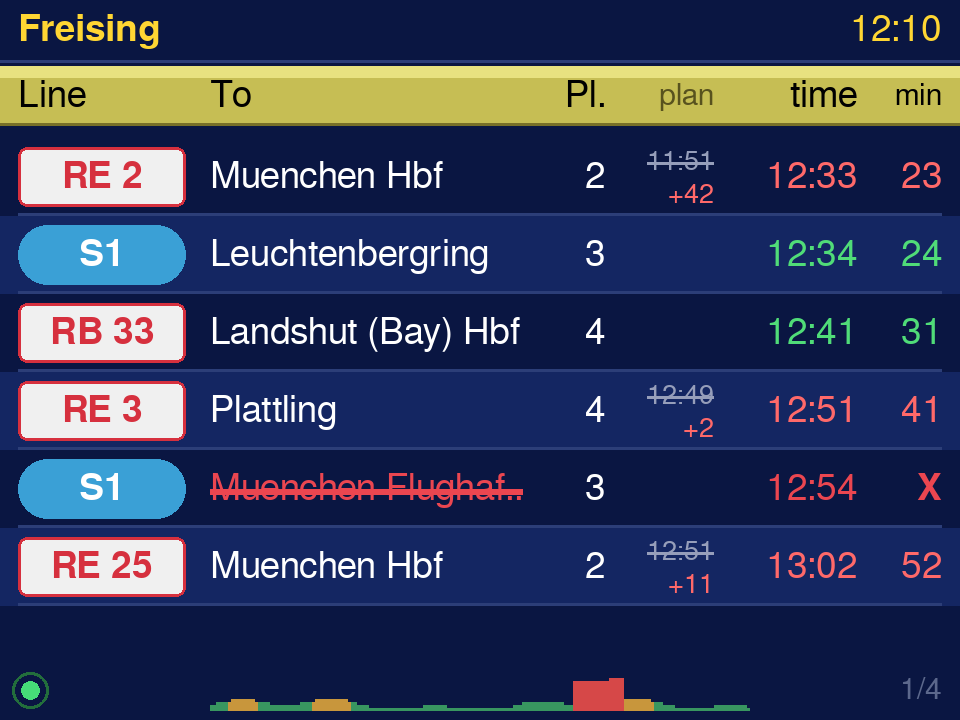
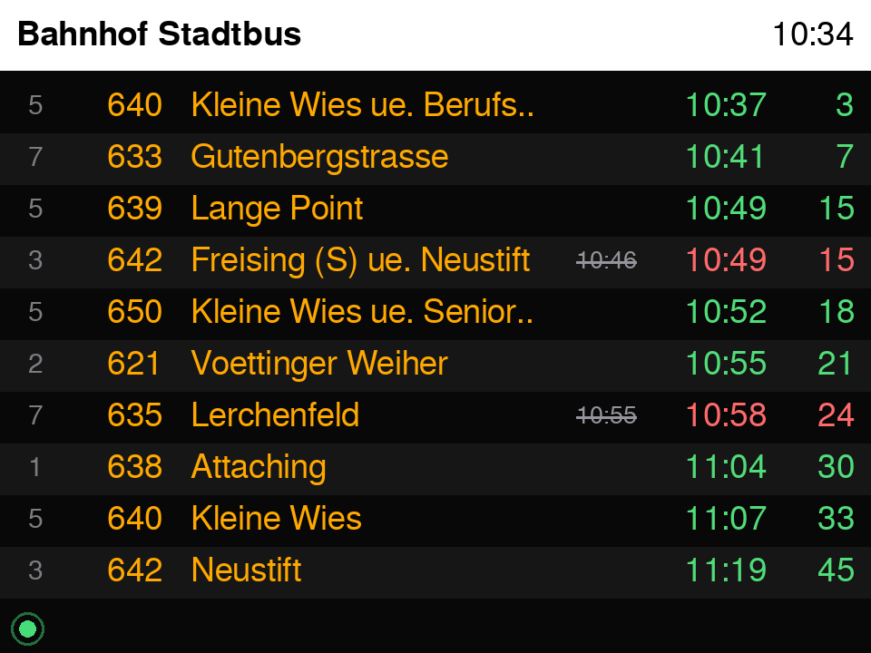
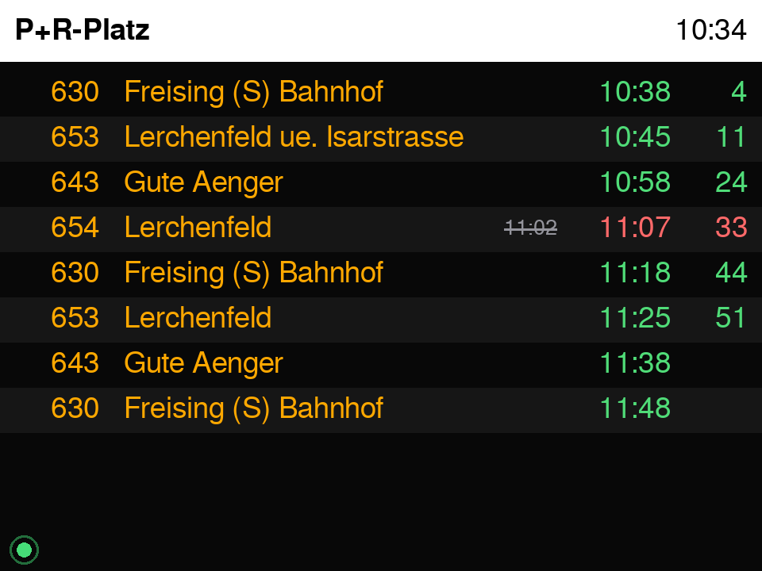
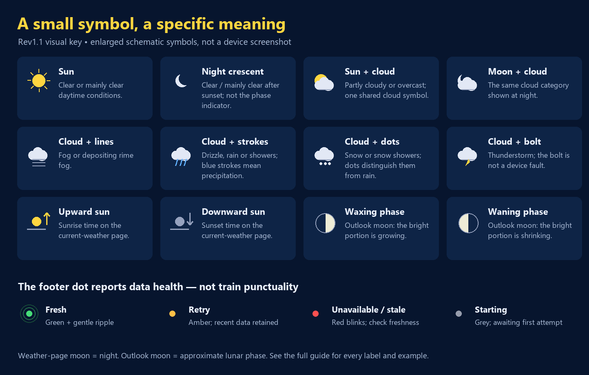
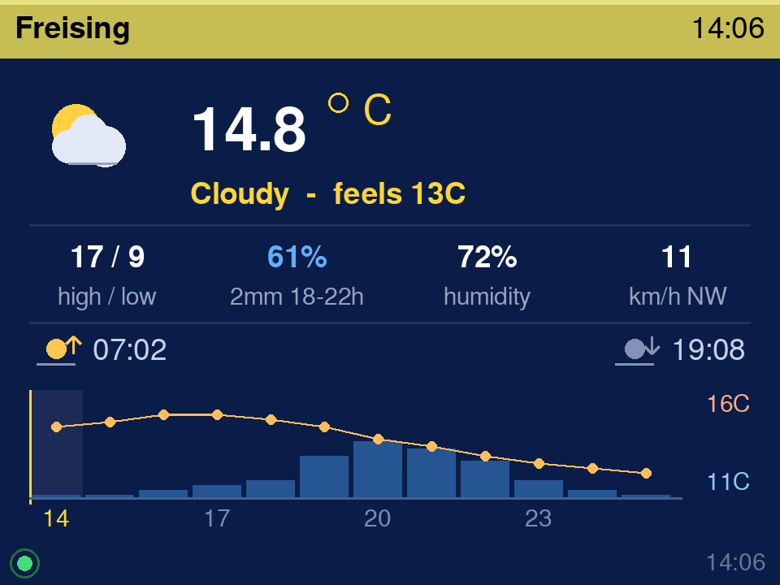
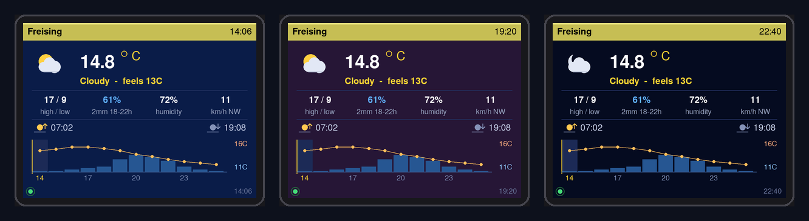
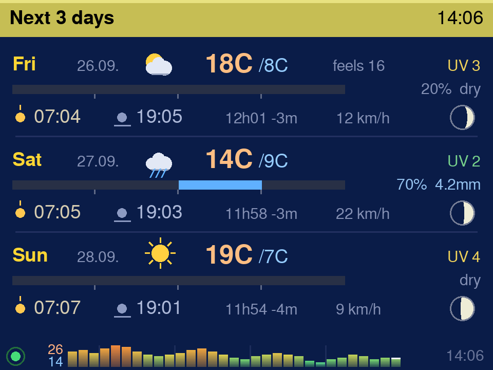
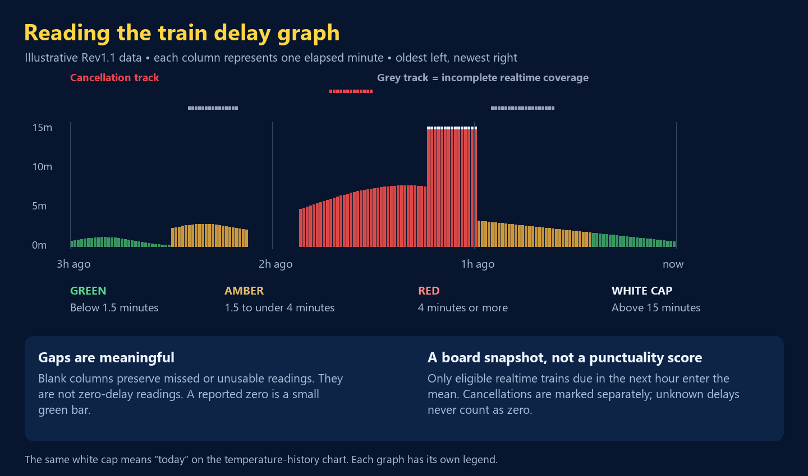
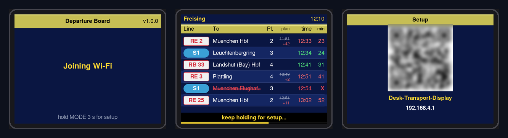
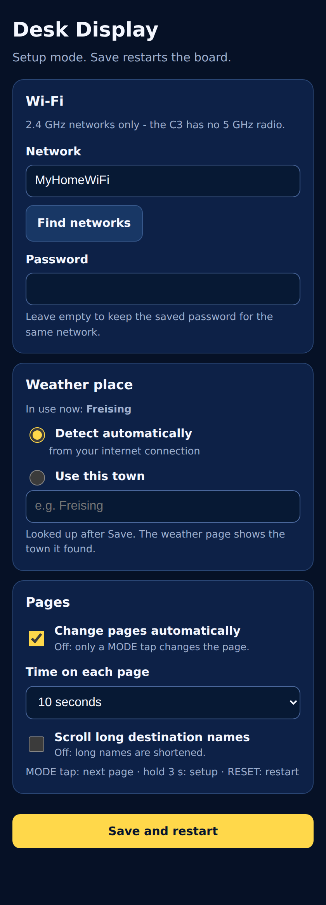

# Complete screen, icon and feature guide

**Rev1.1 · firmware 1.1.0 · Freising desk signboard**

This guide describes the current firmware's visible behaviour. All examples are invented to
explain the display; they are not live departures or a forecast. The enlarged legend diagrams
are explanatory drawings. The other screen renders show the earlier layout and can contain
older version labels and the earlier train graph.

[Back to the project](../README.md) · [Permission and reuse](PERMISSIONS.md)

## Find a feature

- [Pages and navigation](#pages-and-navigation)
- [Train columns, badges and examples](#train-pages)
- [Bus pages and bay markers](#bus-pages)
- [Every weather symbol](#weather-symbols)
- [Current-weather numbers and colours](#weather-now)
- [The next-twelve-hours chart](#next-twelve-hours)
- [Three-day rows, rain timing and moon phase](#next-three-days)
- [The three-hour delay graph](#train-delay-history)
- [The temperature-history graph](#temperature-history)
- [Health dot and messages](#data-health-and-messages)
- [Boot, buttons, setup and QR codes](#boot-controls-and-setup)
- [Settings, examples and troubleshooting](#settings-and-examples)
- [Data limits and release status](#data-limits-and-release-status)

## Pages and navigation

The page sequence is **trains → Bahnhof Stadtbus → P+R-Platz → weather now → next three days**,
then back to trains. Trains occupy one to four pages of six entries, depending on the returned
services. There are therefore five to eight screens in total. Both bus stops always have their
own page, with up to ten departures each.

Tap MODE to move forward. Automatic page changing and long-name scrolling are independent
options and both default to off. With automatic changing enabled, a manual tap also restarts
the page's dwell time. When the train-page count changes, the selected bus/weather page is kept
as the same kind of page rather than unexpectedly jumping to another feed.

| Visual treatment | Meaning and reason |
| --- | --- |
| Navy train page with olive-yellow column band | A station-board style; the band separates labels from departures |
| Alternating row shading and thin rules | Help the eye follow one service across its columns; not another status |
| Black bus page with amber route/destination text | A stop-board style; amber text is normal, not a delay warning |
| Weather background | Time-of-day cue, explained under weather colours below |
| Rows appearing in a short cascade on page changes | Makes the page transition visible without a long animation |
| A long name moving sideways | Optional text scrolling, not movement of the actual vehicle |
| A name ending in `..` | The name was shortened to fit; it is not a special stop name |
| `ae`, `oe`, `ue`, `ss` in some names | German characters are transliterated for the display fonts |

## Train pages

| Item | What it means | Why it is there / example |
| --- | --- | --- |
| `Freising` at top left | The configured rail station | Confirms which station the board covers; changing weather town does not change it |
| Top-right `HH:MM` | The device's current local clock | A reference for departure times; it may be blank before time synchronisation |
| `Line` badge | Train route/service label | `RE22` identifies the service, not its platform |
| White badge, red border and text | Styling used for non-S-Bahn train labels | Separates the service category visually; red here does not mean a delay |
| Blue rounded badge with white text | S-Bahn-style label | For a short label such as `S1`; styling is based on the returned line name |
| `To` | Destination/headsign | Helps identify the right direction |
| `Pl.` | Platform from the feed | `3` means the reported departure platform; `-` means no useful value was supplied |
| `plan` | Original scheduled time, shown when a positive whole-minute delay changes the displayed time | A small struck-through `09:55` explains what changed |
| Small `+5` below the planned time | Reported delay in whole minutes | Five minutes later than scheduled; seconds are truncated for this row label |
| `time` | Returned departure time, using the scheduled time if no usable revised time exists | This is the displayed departure estimate, not confirmation that the train departed |
| Green departure time / countdown | No positive whole-minute delay in the returned data | May still be timetable-only, early, or less than one minute late; green is not proof of live punctuality |
| Red departure time / countdown | A positive reported delay, or cancellation | Gives changes more visual prominence |
| `min` | Rounded minutes remaining, shown only from 0 to 60 | `3` is approximately three minutes; `0` means due around now, not a confirmed departure |
| Empty `min` field | Outside the displayed countdown range or no valid clock | Read the adjacent clock time instead; blank is not cancellation |
| Red struck-through destination and `X` | Service cancelled according to the feed | Cancellation overrides any clock time still visible on the train row |
| `1/3` in the footer | Train page one of three | It counts train pages only; it is not a delay or health score |
| Footer dot and small graph | Feed health and delay-history snapshot | They answer different questions; see their separate legends below |

### Train examples

At a device clock of **09:57**, a train scheduled for **09:55** but now expected at **10:00**
shows ~~09:55~~, **+5**, a red **10:00**, and approximately **3** minutes remaining.

A service returned for **10:00** with no positive reported delay can show **10:00 / 3** in green.
That appearance alone does not tell you whether the provider supplied realtime data. The delay
graph uses a stricter realtime requirement and excludes unknown delays from its mean.

A cancelled service shows a red struck-through destination and **X**. Do not interpret its
remaining time as a valid departure promise. An entry more than about one minute in the past
is removed during the minute update, including when refreshes are failing.

Cancelled train names stay still so their strike-through remains readable. Other long names
can scroll if enabled.

## Bus pages

| Bahnhof Stadtbus | P+R-Platz |
| --- | --- |
|  |  |

The white header names the stop and shows the local clock. The Bahnhof Stadtbus page keeps
city-bus routes, filtering regional/express coach routes. P+R-Platz shows the other configured
stop. Each page has its own health state; there is no shared bus-delay graph.

| Item | Meaning, purpose and example |
| --- | --- |
| Amber route number, e.g. `640` | Which bus to look for; ordinary bus text is amber |
| Amber destination | Where the service is headed; bracketed bay notes and long via-details may be shortened for legibility |
| Small grey bay number | Reported boarding bay; shown as a column only when it distinguishes the visible services |
| Small grey `N`, `S`, `E` or `W` | Approximate side of the stop inferred from available stop coordinates when no real platform label exists; not the bus's travel direction |
| No bay column | No useful variation among available bay labels, or insufficient information; more width is then given to destinations |
| Struck-through small clock time | Scheduled time of a delayed bus, placed left of its revised time |
| Green or red main clock time | Same returned-time convention as the train page; green is not a guarantee of realtime data |
| Rightmost number | Rounded minutes to departure, 0–60; absent outside that range |
| Red destination strike-through and `X` | Cancellation; the bus row suppresses the normal time/countdown block |

**Example:** at **10:27**, a bus scheduled for **10:27** but expected at **10:30** shows the
struck-through planned time, red **10:30**, and **3**. Unlike the taller train row, the bus row
does not add a separate `+3` line. A grey bay **4** means board at the reported bay 4; an inferred
**N** is only a rough side-of-stop aid and should be checked against actual signage.

## Weather symbols

The condition pictogram is a compact category symbol, not a live camera image. The current
page selects its day/night variation using the day's sunrise and sunset. Outlook rows use
daytime condition symbols because they summarize a whole day.

| Shape | Meaning | Why / example |
| --- | --- | --- |
| Yellow sun with rays | Clear or mainly clear, daytime | A quick sky-condition cue |
| Pale crescent without a cloud | Clear/mainly clear at night | Replaces the sun after sunset or before sunrise; this crescent is not the calculated moon phase |
| Sun partly behind a pale cloud | Partly cloudy or overcast | One cloud category keeps the tiny icon simple; an overcast forecast can still use this symbol |
| Crescent partly behind a cloud | The cloud category at night | Same weather grouping with a night cue |
| Cloud plus horizontal grey lines | Fog, including depositing rime fog | Horizontal layers distinguish fog from falling precipitation |
| Cloud plus blue diagonal strokes | Drizzle, rain, freezing rain/drizzle or rain showers | Blue falling strokes signal the precipitation category; intensity/freezing details are not individually drawn |
| Cloud plus pale dots below | Snow, snow grains or snow showers | Dots differentiate frozen precipitation from the rain strokes |
| Cloud plus yellow lightning bolt | Thunderstorm category | It describes weather; it is not an electrical or battery fault indicator |
| No condition pictogram | Missing/unrecognised condition code | An absent icon should not be interpreted as clear weather |

The text description is deliberately brief: `Clear`, `Cloudy`, `Fog`, `Rain`, `Snow`, `Showers`
or `Thunderstorm`. The current implementation groups condition codes 1–3 under the text
`Cloudy`, although code 1 uses the mainly-clear sun/moon icon. The symbol and short text are
therefore not a detailed cloud-percentage report.

The category groups follow the provider's [weather-code reference](https://open-meteo.com/en/docs).
The guide describes the project's simplified rendering rather than claiming a distinct symbol
for every possible weather code.

## Weather now

| Item | Meaning | Why / example |
| --- | --- | --- |
| Town name in header | Weather location currently in use | Confirms which town the forecast lookup selected |
| Header clock | Current local device time | Different from the last-refresh time in the footer |
| Large number plus yellow degree ring and `C` | Current air temperature in Celsius | `18.4 °C`; the small ring is the degree sign, not another status dot |
| `feels 17C` | Current apparent temperature | A compact comparison with air temperature; it incorporates more than air temperature alone |
| `high / low` | Today's forecast maximum and minimum | `22 / 11` is the daily range in Celsius, not two current sensor readings |
| Blue percentage | Today's maximum hourly precipitation probability | `70%` is a likelihood statistic, not “70% of the day is wet” |
| Small `3mm 12-16h` below rain | Daily precipitation amount and the first-to-last qualifying wet-hour window | Amount is rounded to whole millimetres here; the time span may contain dry gaps |
| `at 15h` | A single qualifying wet hour | Approximately 15:00–16:00 in the model's hourly bins |
| `rain` without a time window | No qualifying wet-hour window was identified | It does not establish that precipitation is impossible |
| `humidity` percentage | Current relative humidity | A separate measurement from precipitation probability |
| Wind number with `km/h` | Current wind speed | `18` means approximately 18 kilometres per hour |
| Compass letters `N NE E SE S SW W NW` | Direction the wind comes **from** | `km/h NW` means wind from the northwest, not toward it |
| Sun above a horizon with upward arrow | Sunrise time | The upward cue distinguishes morning from evening |
| Sun above a horizon with downward arrow | Sunset time | The downward cue identifies the end of daylight |
| Faint bottom-right clock | Time of the last successful weather fetch on the device | It is not the forecast model's issue time, and does not describe temperature-history freshness |

### Temperature and background colours

The large temperature is blue at **0 °C or below**, pale blue above 0 through **10 °C**, white
above 10 through **20 °C**, warm cream above 20 through **27 °C**, and orange above **27 °C**.
These are visual temperature cues, not official weather warnings.

The weather background is lighter blue in daytime, plum within approximately **40 minutes
before or after sunrise/sunset**, and deep navy at night outside those transition windows.
It falls back to the daytime colour when time/sun information is unavailable. The background
can be plum while a sun or crescent is shown because twilight colouring and the day/night
condition symbol use different boundaries. Colours update when the page redraws.

## Next twelve hours

The strip at the bottom of the current-weather page combines two measurements with different
scales. Normally it starts with the current hour and continues for up to twelve returned hours.
It needs at least two usable temperature points to appear.

| Mark | Meaning and reason |
| --- | --- |
| Blue vertical bars | Hourly precipitation probability; taller means more likely, not more millimetres |
| Orange line and small orange dots | Hourly temperature trend; dots identify the sampled hourly points |
| Warm/cool numeric `C` labels on the right | Upper and lower limits of the temperature plot; read these before comparing slopes across days |
| Yellow left edge, tinted first column and yellow first hour label | Identifies the strip's starting/current-hour position under normal complete data |
| Hour labels such as `09`, `12`, `15` | Local hour, printed every third point to keep the strip readable; the sequence may cross midnight |

**Example:** a tall blue bar at `15` with a falling orange line suggests a higher precipitation
probability around 15:00 while the temperature forecast is falling. The line is automatically
scaled with at least a 3 °C range; a steep-looking line is not automatically a large change.
If the provider omits hours, the compact strip can skip unusable points and its first column
is only the first retained hour, so do not assume perfect hourly coverage from position alone.

## Next three days

There is one row for each of the next three days **after today**. Each row has three bands:
conditions/temperatures, rain timing, then sun/daylight/wind/moon information.

| Item | Meaning and reason |
| --- | --- |
| Yellow `Mon`, `Tue`, etc. and small `DD.MM.` | Day and date; the date makes the correct day identifiable at a glance |
| Small condition icon | Day's summary condition, using the weather-symbol groups above |
| Warm-coloured `21C` and cool `/10C` | Daily high and low; the slash pairs the two values |
| Small `feels 19` | Daily maximum apparent temperature, shown only when it differs from the high by at least 1 °C; it need not occur at the same hour as the actual high |
| `UV 4` | Rounded daily maximum UV index, not degrees or a percentage |
| UV green / yellow / orange / red | Display bands 0–2 / 3–5 / 6–7 / 8 and above; red combines the higher categories |
| Dark horizontal trough with blue stretches | Twenty-four-hour precipitation timing bar, detailed below |
| `40% 1.2mm` beside the bar | Daily maximum precipitation probability and daily precipitation total |
| `dry` or `20% dry` | No hourly bin crossed the project's wet-hour threshold; a nonzero probability can still be shown |
| Small yellow sun with short line above it | Sunrise, a compact version of the larger sunrise symbol |
| Small muted sun with a line underneath | Sunset, a compact version of the larger sunset symbol |
| `12h05` | Time from sunrise to sunset: 12 hours 5 minutes, not hours of unclouded sunshine |
| `+2m` or `-3m` beside day length | Change from the preceding day's daylight duration; omitted when zero |
| `18 km/h` | Daily maximum wind speed; this compact row intentionally has no direction arrow |
| Small shaded moon disc at the far right | Approximate lunar phase for that day, detailed below |

### Reading the rain-timing bar

Left is **00:00**, right is **24:00**. Small ticks underneath mark **06:00**, **12:00** and
**18:00**. A blue segment is an hourly bin with forecast precipitation of at least **0.1 mm**
**or** probability of at least **60%**. The dark trough means the threshold was not met; it is
not proof of zero risk or complete input data. Precipitation can include snow-water equivalent.

**Example:** blue around **07:00–09:00** and again **17:00–18:00**, with darkness in between,
shows two qualifying periods. The one-line current-weather label may summarize that as
`7-18h`; this bar preserves the intervening gap. It is a timing display, not a probability-height
chart: the probability bars are on the other weather page.

### Reading the moon disc

A mostly dark disc is near new moon; a thin bright portion is a crescent; half-bright is a
quarter phase; a mostly bright disc is gibbous; a bright full disc is near full moon. The
right-hand bright side depicts waxing and the left-hand bright side depicts waning in this
display's convention. The rim keeps a dark disc visible.

This phase is calculated approximately from the date using a fixed lunar cycle. It is not
measured by the board, not a moonrise time, and not the generic night crescent on the current
weather page. Treat it as a visual calendar cue, not an astronomical ephemeris.

## Train delay history

This footer is shared across all train pages. Each observation concerns fetched non-cancelled
trains due from now through the next hour with comparable realtime and scheduled times.
Their positive reported delays are averaged; early running contributes zero lateness. The
same upcoming train can appear in successive observations. This is a **board-snapshot history**,
not final departure performance for unique trains.

| Mark | Meaning and reason |
| --- | --- |
| `3h` and 180 columns | Three hours of elapsed-minute slots, oldest left and newest right |
| Faint vertical guides | Hour divisions; they remain even where samples are missing |
| Green bar | Average reported delay below 1.5 minutes |
| Amber bar | Average from 1.5 to under 4 minutes |
| Red bar | Average 4 minutes or more |
| A one-pixel green baseline bar | A usable sample reporting zero lateness; different from a missing sample |
| `15m` | Full visible bar-height scale, 15 minutes |
| White cap on a tall bar | Average exceeds the visible 15-minute scale; it has not been treated as merely 15 minutes in the calculation |
| Red dots in the separate top track | At least one returned cancellation in the same next-hour window |
| Grey dots in the track below | At least one non-cancelled candidate lacked usable realtime comparison |
| Blank interval | Missing/failed refresh, no eligible observation or invalid clock; not a zero-delay claim |

One cancellation plus one reported on-time train gives a cancellation marker and zero delay,
not an invented average of 7.5 minutes. A timetable-only board has no numeric delay bar and
can have the grey coverage marker. Two reported delays of 90 and 180 seconds average to
**2.3 minutes** after rounding once to a tenth. An early train does not subtract from another's delay.

Multiple responses within one minute replace that minute's reading. Outages retain gaps;
old samples age out even if no new response arrives. History is held in RAM and clears on
restart, including an automatic recovery restart. The fetched board is capped at 24 trains,
so it is not a complete census of station traffic or a measure of all cancellations.

## Temperature history

The small graph at the bottom of the three-day page is a different measurement: up to **30
previous daily highs plus today's high**, supplied by the weather service. These are provider
weather/model values, not readings from a temperature sensor in this desk device. Today's
high is still a forecast value.

| Mark | Meaning and reason |
| --- | --- |
| One bar per day | Oldest left, today on the right; shorter available histories leave unused space |
| Height | Each day's high, scaled to the current window; not the fixed delay-graph scale |
| Blue through cyan/green to yellow/orange/red | Cooler to warmer temperature; smoothly blended rather than a warning level |
| Fade toward the bottom | A visual treatment to keep a dense footer quieter; not extra data |
| Warm upper and cool lower numbers at left | Highest and lowest **daily high** within the displayed window; the lower number is not a nightly low |
| Faint week marks | One, two, three and four weeks back from today |
| White cap on the final bar | Identifies today; unlike the train graph, it does not mean scale overflow |
| Missing bar | No usable daily high for that position |

The colour reference runs from blue at roughly **−10/0 °C**, through cyan near **8 °C**, green
near **15 °C**, yellow near **20 °C**, orange near **25 °C**, and red near **32 °C**. This history
is fetched at boot and refreshed on roughly a six-hour schedule. The weather footer's refresh
time and health dot describe the main forecast feed, not independent freshness of this history.

## Data health and messages

The small footer dot reports the health of **the feed used by the current page**. A healthy
weather response cannot make a failed train page green. A cancellation is a transport event,
not necessarily an unhealthy API, so a green dot and a cancelled train can correctly coexist.

| Appearance | Meaning | Why / example |
| --- | --- | --- |
| Grey dot | No first fetch attempt completed yet, while Wi-Fi is connected | Startup is different from an established good reading |
| Green with an expanding faint ripple | Latest fetch succeeded and the feed is still fresh | A small heartbeat shows that the display loop is active |
| Amber/yellow | Latest fetch failed, but a previous good reading is still recent | A temporary retry can usefully retain the last response |
| Blinking red | Wi-Fi disconnected, no usable data after an attempt, or last good data at least 3.5 minutes old | Makes stale/unavailable data visible; do not treat retained entries as confirmed current information |
| Dimmer dot of the same colour | Network work is in progress | Busy does not replace or conceal an existing failure state; the healthy ripple pauses |
| Faint red outline during a blink's dark half | Position of the red indicator | Prevents the missing-looking dot from being mistaken for no indicator |

| Text | Meaning |
| --- | --- |
| `Loading...` | First result is still awaited |
| `No departures` | A recent successful response left no displayed departures, including after expiry |
| `Data unavailable` | The departure feed failed or is stale |
| `No weather data` / `No forecast` | A suitable weather/current or outlook result is unavailable |
| `Live` | All principal feeds in the latest refresh cycle succeeded; not a guarantee that every train has realtime data |
| `Partly offline` | Some feeds succeeded and others failed |
| `Data source offline` | No principal feed in that cycle succeeded |
| Empty field or `-` | A value may be missing or intentionally omitted to avoid repetition |

Refreshes are attempted around a one-minute cadence, with network delays affecting actual
completion. Countdown rows still update each minute during an outage. Persistent failures
trigger recovery: Wi-Fi reconnect attempts, and eventually a restart after prolonged Wi-Fi or
data loss. No new departure information can be created while offline.

## Boot, controls and setup

| Visible item or action | Meaning and reason |
| --- | --- |
| `Departure Board` and `v1.1.0` on startup | Project and installed firmware identity |
| Startup status line | Progress such as starting or joining Wi-Fi |
| Red last-restart information | Stored diagnostic reason, such as a power dip or watchdog reset; not a new weather/transport alert |
| MODE tap | Advance exactly one page after debounce |
| MODE held for about one second | Show `keep holding for setup...` |
| Yellow bar filling along the bottom during a running-screen hold | Progress from the one-second hint toward the three-second setup action |
| Release after the hint but before three seconds | Restore the current page without opening setup |
| Hold through three seconds | Enter setup; MODE also works during the startup Wi-Fi join |
| RESET | Restart the board |
| `Setup` header | The device is showing setup instructions, not refreshing its normal boards |

MODE is the physical BOOT button. Holding it while applying power or pressing RESET can enter
the chip's flashing/download mode and leave the display dark. Release it, reset, then start
the hold after the splash appears.

### Two different QR payloads

1. **Before a phone is connected:** the QR contains the setup network name and its password.
   It is a Wi-Fi-join shortcut; the password is not separately printed as text.
2. **After a device connects to the setup access point:** the same QR area changes to the
   local settings-page address. Scan again or browse to **http://192.168.4.1/**.

`Desk-Transport-Display` identifies the setup Wi-Fi. The printed `192.168.4.1` is the local
setup address, not a public internet site. A red connection-error line explains a failed join
when present. Do not publish a photograph of your actual join QR if its embedded password
should stay private; documentation QR pictures are examples.

Setup opens on first use with no usable saved/fallback network, after startup cannot join,
or on the long hold. It does not expire on a timer. Save restarts the board; RESET exits by
restarting. The normal display mode does not offer the settings web server.

## Settings and examples

| Setting or label | What it does and why |
| --- | --- |
| Network | Your 2.4 GHz Wi-Fi name; the ESP32-C3 cannot join 5 GHz-only networks |
| `Find networks` / `Scan again` | Scan for visible names; results are sorted strongest first |
| RSSI, e.g. `−50 dBm` | Received signal strength; −50 is stronger than −80, not a percentage |
| Password | Network password; blank keeps the stored password only when retaining the same network name |
| Typed hidden network name | Allows a direct join even if the name does not appear in scans |
| `In use now` | Currently resolved weather location; `(default)` indicates the fallback label |
| Detect automatically | Approximate location from the internet connection; VPN/provider routing may point elsewhere |
| Use this town | Look up the typed town after saving; check the resolved name on the weather page |
| Change pages automatically | Switch pages after the selected interval rather than only with MODE |
| Time on each page | Default 10 seconds; standard options 5, 10, 15, 20, 30, 45 and 60 seconds |
| Scroll long destination names | Independently allows text to slide so more of a long name can be read |
| Save and restart | Validate and store the configuration, then restart into normal mode |
| `Saving...` / disabled Save | A save attempt is underway; wait for its result |
| Saved/restarting confirmation | The board acknowledged the save; reconnect the phone to normal Wi-Fi |
| `No confirmation received...` | The browser did not confirm the outcome; check the board and reconnect before retrying |
| Last unexpected restart with optional count | Helps identify repeated power or blocking problems; it is not a current network signal reading |

**Example:** keep manual page selection, turn on scrolling, and enter `Freising` as the weather
town. After Save, pages will still change only by MODE, but long destinations can move. Choosing
a different weather town changes the forecast location, not the fixed Freising transport stops.

### Common questions

| Observation | Explanation / next step |
| --- | --- |
| Green train time but a blank delay graph | The row may be timetable-only; the graph requires usable realtime comparison |
| Green health dot but red delay bars | Fetching succeeded, while the returned trains were late |
| Grey coverage marker with green delay bar | Known delays are small, but some candidate services lack usable realtime comparison |
| Weather clock moves but data is old | The header clock is local time; check the footer time and health dot |
| `dry` next to a nonzero probability | No hourly bin crossed the wet-hour rule; “dry” is not a guarantee |
| An unexpected weather town | Automatic IP location or the first town-search match may differ from the intended place |
| Empty destination suffix or abbreviated text | Small-screen clipping/transliteration; enable scrolling for more of the name |
| `nan` or an impossible value such as negative humidity | Incomplete upstream fields can expose an unavailable-value placeholder; it is not a valid measurement |
| History disappeared | It is RAM-only for train delay; restart clears it, then new observations fill it |
| Dark screen after holding BOOT during power-on | Release BOOT and press RESET, then hold only after startup begins |
| Frequent power-dip restart notices | Inspect the board's power supply, USB cable and wiring |

## Data limits and release status

Transport comes through [Transitous](https://transitous.org/); realtime availability and cancellations
depend on the underlying operators. Weather comes from [Open-Meteo](https://open-meteo.com/).
The device has no local weather sensor, GPS tracker, live vehicle-position display, official
service-alert system, touchscreen controls or audible departure alarm in this revision.

The configured station/stops are fixed in firmware. Forecast display time uses Europe/Berlin;
selecting a faraway weather town does not make this a general world-time display. Font space,
provider coverage and a small fixed departure buffer limit what can be shown. Consult official
operator information when a departure or cancellation matters.

Rev1.1 source passed compile/link verification, 52 logic/graph assertions and five setup-page
JavaScript scenarios. This documentation and permission-policy finalization does not change
firmware behaviour. Physical flashing, tiny-icon legibility on the actual panel, overnight
stability and enclosure fit remain unverified in this review. See the
[release status](PROJECT_STATUS.md) for the completed deliverables and those physical checks.

The original artwork, documentation and project material remain subject to the
[proprietary licence](../LICENSE) and [AI-use policy](../AI_POLICY.md).
