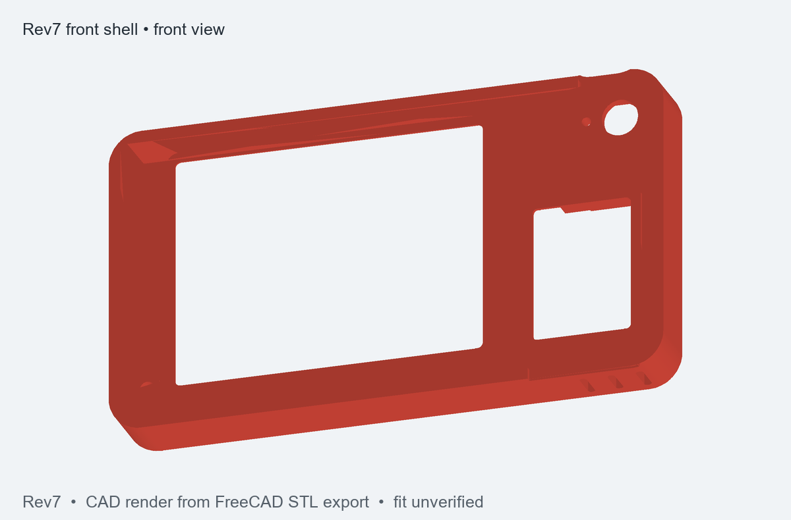

# 3D printed enclosure

The current design is [Rev7](rev7/README_REV7.md). It replaces clips with three M2.5 heat-set
inserts and three countersunk screws. The Rev7 folder contains the FreeCAD source model, STEP,
STL parts, optional fit test, 3MF print layout and CAD illustrations. The
[preview renderer](freecad/render_rev7_previews.py) recreates the images from the STL exports
with NumPy and Pillow.

Print the optional fit test before committing to the full case. Display, ESP32 board, USB,
BOOT key, screw engagement and enclosure fit have not been physically verified for this revision.

## Tilted desk version — coming soon

A 15° tilted desk variant is in development. CAD views and print files will be posted when the
design is ready. The Rev7 files above are the currently documented printable enclosure.

## Physical photos — coming soon

- Finished 3D-printed enclosure photos
- Photos of the powered signboard in everyday use

The [station-display inspiration photo](../docs/images/inspiration_station_display.jpg) is a
reference image, not a photo of this enclosure or a finished device.
