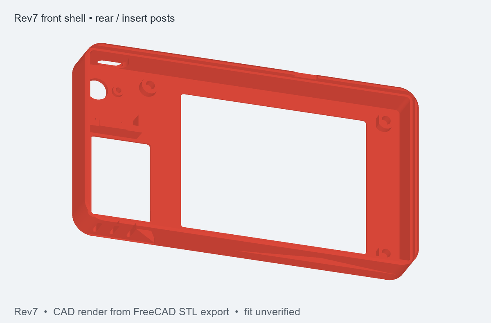
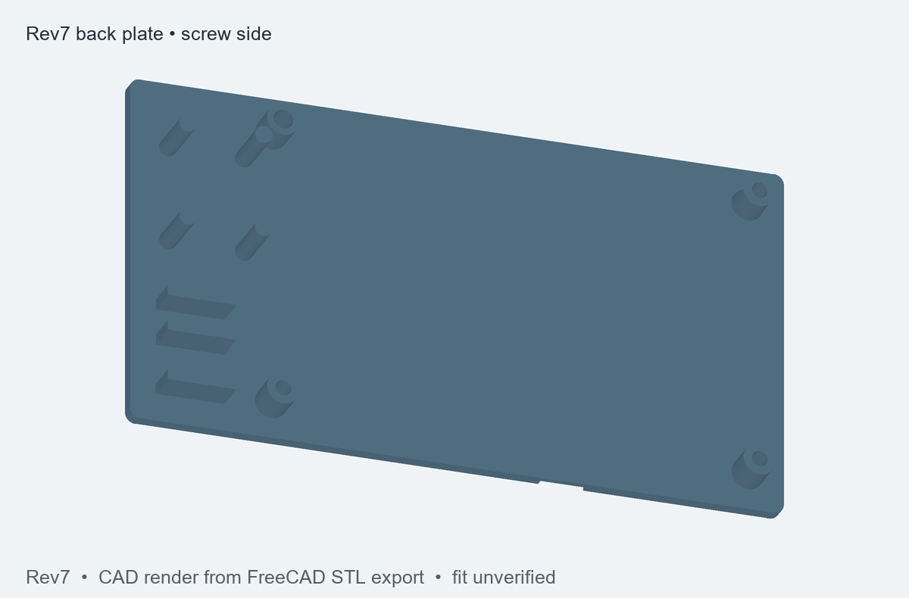

# DB signboard enclosure - Rev7 (screws + heat-set inserts instead of clips)

| Interior and insert posts | Back plate |
| --- | --- |
|  |  |

These views are rendered from the FreeCAD model's STL exports. They are illustrations, not
photographs or evidence of a completed fit test. The editable model is
[`DB_signboard_enclosure_rev7.FCStd`](DB_signboard_enclosure_rev7.FCStd); the neutral CAD export is
[`DB_signboard_enclosure_rev7.step`](DB_signboard_enclosure_rev7.step). A ready-to-arrange print
project is in [`rev7_print_v1.3mf`](rev7_print_v1.3mf).

## Print
| File | How | Settings |
|---|---|---|
| `rev7_1_front_shell.stl` | front face down | PLA, 0.2 mm, 3 walls (4 is better around the insert posts), 15 % infill, no supports |
| `rev7_2_back_plate.stl` | flat back down | same |

Keep your Rev6 key (`rev7_3_boot_key.stl` is identical). No clips any more.

## Hardware (from Sam's kits)
- 3 x **M2.5 x 3 x 3.5** knurled brass inserts (TexSync kit: "M2.5x3x3.5")
- 3 x **M2.5 x 12** flat-head (countersunk) Phillips screws (AIMUNOK kit)

## Assembly
1. **Inserts:** soldering iron at ~210-220 C. Put each insert on its post (the 3 posts at bottom-left, top-left and
   bottom-right corners of the display area) and press it straight down until its top is flush with the post top.
   Let it cool. There is 1.5 mm of front wall under each insert, so the front face stays clean.
2. Key into its hole, Super Mini into its band (as before).
3. Display glass-down onto the 3 insert posts, its holes over the inserts.
4. Back plate on (it sits on the step all round). Screw the 3 M2.5 x 12 screws in from the back, through the plate,
   the spacer and the display hole into the insert. Before the final turn, nudge the display so the picture is centred
   in the window (the screws have ~0.3 mm play in the display holes), then tighten gently - snug is enough.
5. The heads sit 1 mm below the back face, so tape on the back stays flat. To open: undo the 3 screws; the pry notch
   at the bottom helps to lift the plate.

## What each screw does
back plate countersink -> solid spacer (presses the display board) -> display mounting hole -> brass insert in the
front shell post. So the same 3 screws close the case AND clamp the display. The top-right corner has no screw
(the paper slot runs there); the step around the rim and the other 3 corners hold it.

## Checks (script)
- screws only meet their insert holes (0 overlap with shell, back plate, display); thread engagement 2.8 mm; screw tip
  0.5 mm above the bottom of the insert hole
- insert post Ø6 with a flat 0.3 mm from the display glass; everything else as Rev6 (key, board, paper slot, no overlaps)
